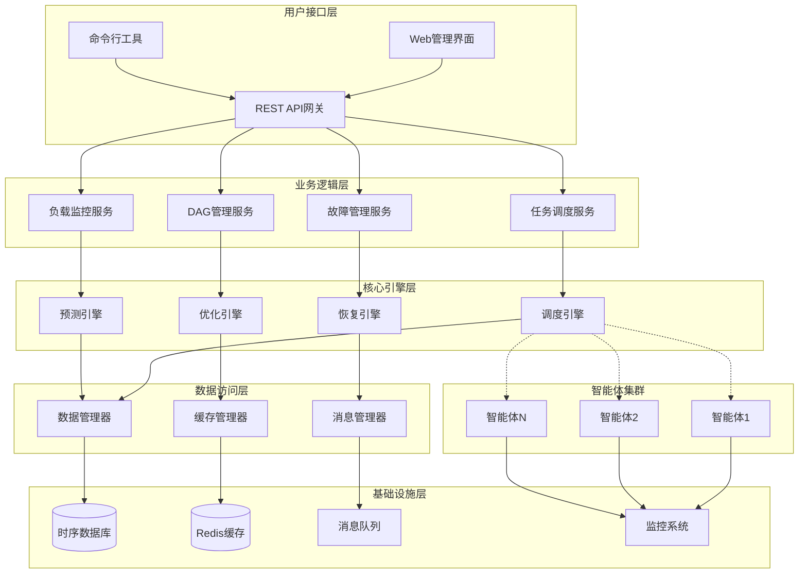

# 设计文档

## 概述

本设计文档详细描述了基于任务DAG和负载感知的多智能体任务调度系统的技术架构、核心组件和实现方案。系统采用分层架构设计，通过智能体负载感知、自适应DAG优化、预测性调度算法和分层故障恢复等核心技术，实现高效、可靠的多智能体任务调度。

## 系统架构

### 整体架构设计

系统采用分层微服务架构，主要包含以下层次：



### 核心架构原则

1. **分层解耦**：各层之间通过标准接口通信，降低耦合度
2. **微服务化**：核心功能模块化，支持独立部署和扩展
3. **事件驱动**：基于事件的异步通信机制，提高系统响应性
4. **数据一致性**：采用最终一致性模型，保证分布式数据一致性
5. **高可用性**：关键组件支持集群部署和故障转移

## 核心组件设计

### 1. 任务DAG管理组件

#### 1.1 DAG构建器 (DAG Builder)

**功能职责：**
- 自动分析任务依赖关系
- 构建有向无环图结构
- 检测和处理循环依赖

**核心算法：**
```python
class DAGBuilder:
    def build_dag(self, task_definition):
        """
        构建任务DAG
        """
        # 1. 解析任务定义
        tasks = self.parse_tasks(task_definition)
        
        # 2. 识别依赖关系
        dependencies = self.identify_dependencies(tasks)
        
        # 3. 循环检测
        if self.has_cycle(dependencies):
            raise CyclicDependencyError("检测到循环依赖")
        
        # 4. 构建DAG结构
        dag = self.create_dag_structure(tasks, dependencies)
        
        # 5. 关键路径分析
        critical_path = self.analyze_critical_path(dag)
        
        return DAGStructure(dag, critical_path)
```

**数据结构：**
```python
@dataclass
class TaskNode:
    task_id: str
    task_type: str
    requirements: Dict[str, Any]
    estimated_duration: float
    dependencies: List[str]
    status: TaskStatus
    
@dataclass
class DAGStructure:
    nodes: Dict[str, TaskNode]
    edges: List[Tuple[str, str]]
    critical_path: List[str]
    parallel_groups: List[List[str]]
```

#### 1.2 DAG优化器 (DAG Optimizer)

**功能职责：**
- 动态优化DAG结构
- 最大化任务并行度
- 减少关键路径长度

**优化策略：**
```python
class DAGOptimizer:
    def optimize_dag(self, dag: DAGStructure, agent_capabilities: Dict):
        """
        优化DAG结构
        """
        # 1. 并行度优化
        optimized_dag = self.optimize_parallelism(dag)
        
        # 2. 资源约束优化
        optimized_dag = self.optimize_resource_constraints(
            optimized_dag, agent_capabilities
        )
        
        # 3. 负载均衡优化
        optimized_dag = self.optimize_load_balance(optimized_dag)
        
        return optimized_dag
    
    def optimize_parallelism(self, dag: DAGStructure):
        """
        优化任务并行度
        """
        # 识别可并行执行的任务组
        parallel_groups = self.identify_parallel_groups(dag)
        
        # 重组任务分组以最大化并行度
        return self.reorganize_parallel_groups(dag, parallel_groups)
```

### 2. 智能体负载感知组件

#### 2.1 负载监控器 (Load Monitor)

**功能职责：**
- 实时收集智能体负载数据
- 多维度负载指标计算
- 负载状态评估和预警

**监控指标体系：**
```python
@dataclass
class LoadMetrics:
    # 计算负载指标
    cpu_usage: float          # CPU使用率 (0-1)
    memory_usage: float       # 内存使用率 (0-1)
    disk_io_rate: float      # 磁盘I/O速率 (MB/s)
    
    # 网络负载指标
    network_bandwidth: float  # 网络带宽使用率 (0-1)
    network_latency: float   # 网络延迟 (ms)
    packet_loss_rate: float  # 丢包率 (0-1)
    
    # 任务匹配指标
    task_match_score: float  # 任务匹配度 (0-1)
    specialization_score: float  # 专业化程度 (0-1)
    
    # 历史性能指标
    success_rate: float      # 任务成功率 (0-1)
    avg_execution_time: float  # 平均执行时间 (s)
    resource_efficiency: float  # 资源利用效率 (0-1)
    
    timestamp: datetime
```

**负载评估算法：**
```python
class LoadEvaluator:
    def __init__(self):
        # 动态权重系数
        self.weights = {
            'cpu': 0.25,
            'memory': 0.20,
            'network': 0.15,
            'task_match': 0.25,
            'history': 0.15
        }
    
    def calculate_load_score(self, metrics: LoadMetrics, task_type: str):
        """
        计算综合负载评分
        """
        # 动态调整权重
        adjusted_weights = self.adjust_weights(task_type)
        
        # 计算各维度得分
        cpu_score = metrics.cpu_usage
        memory_score = metrics.memory_usage
        network_score = (metrics.network_bandwidth + 
                        metrics.network_latency / 100 + 
                        metrics.packet_loss_rate) / 3
        
        task_match_score = 1 - metrics.task_match_score  # 匹配度越高，负载越低
        history_score = (1 - metrics.success_rate + 
                        metrics.avg_execution_time / 3600 + 
                        1 - metrics.resource_efficiency) / 3
        
        # 加权综合评分
        load_score = (
            adjusted_weights['cpu'] * cpu_score +
            adjusted_weights['memory'] * memory_score +
            adjusted_weights['network'] * network_score +
            adjusted_weights['task_match'] * task_match_score +
            adjusted_weights['history'] * history_score
        )
        
        return min(load_score, 1.0)  # 限制在[0,1]范围内
```

#### 2.2 负载预测器 (Load Predictor)

**功能职责：**
- 基于历史数据预测负载趋势
- 支持短期、中期、长期预测
- 为调度决策提供前瞻性信息

**预测模型：**
```python
class LoadPredictor:
    def __init__(self):
        self.short_term_model = ARIMAModel()  # 短期预测(1-10分钟)
        self.medium_term_model = LSTMModel()  # 中期预测(10分钟-1小时)
        self.long_term_model = ProphetModel() # 长期预测(1小时以上)
    
    def predict_load(self, agent_id: str, prediction_horizon: int):
        """
        预测智能体负载
        """
        historical_data = self.get_historical_data(agent_id)
        
        if prediction_horizon <= 10:  # 短期预测
            return self.short_term_model.predict(historical_data, prediction_horizon)
        elif prediction_horizon <= 60:  # 中期预测
            return self.medium_term_model.predict(historical_data, prediction_horizon)
        else:  # 长期预测
            return self.long_term_model.predict(historical_data, prediction_horizon)
```

### 3. 智能调度引擎组件

#### 3.1 调度决策器 (Scheduler)

**功能职责：**
- 执行多目标优化调度
- 实现分层调度策略
- 动态调整调度参数

**多目标优化模型：**
```python
class MultiObjectiveScheduler:
    def __init__(self):
        self.objectives = {
            'execution_time': 0.4,    # 执行时间权重
            'load_balance': 0.3,      # 负载均衡权重
            'communication_cost': 0.2, # 通信成本权重
            'energy_consumption': 0.1  # 能耗权重
        }
        
        # 任务类型特定的调度器
        self.task_schedulers = {
            TaskType.MODEL_REQUEST: ModelRequestScheduler(),
            TaskType.TOOL_REQUEST: ToolRequestScheduler(),
            TaskType.COMPUTE_INTENSIVE: ComputeIntensiveScheduler(),
            TaskType.IO_INTENSIVE: IOIntensiveScheduler(),
            TaskType.COMMUNICATION_INTENSIVE: CommunicationIntensiveScheduler(),
            TaskType.MIXED: MixedTaskScheduler()
        }
    
    def schedule_task(self, task: Task, available_agents: List[Agent]):
        """
        多目标优化任务调度
        """
        # 首先进行任务类型特定的预筛选
        compatible_agents = self.filter_compatible_agents(task, available_agents)
        
        if not compatible_agents:
            raise NoCompatibleAgentException(f"No compatible agents for task {task.task_id}")
        
        # 使用任务类型特定的调度器
        task_scheduler = self.task_schedulers[task.task_type]
        candidate_agents = task_scheduler.rank_agents(task, compatible_agents)
        
        # 多目标优化评分
        best_agent = None
        best_score = float('inf')
        
        for agent in candidate_agents:
            # 计算各目标函数值
            exec_time = self.estimate_execution_time(task, agent)
            load_imbalance = self.calculate_load_imbalance(agent)
            comm_cost = self.calculate_communication_cost(task, agent)
            energy_cost = self.estimate_energy_consumption(task, agent)
            
            # 任务类型特定的权重调整
            adjusted_objectives = self.adjust_objectives_for_task_type(task.task_type)
            
            # 多目标优化评分
            score = (
                adjusted_objectives['execution_time'] * exec_time +
                adjusted_objectives['load_balance'] * load_imbalance +
                adjusted_objectives['communication_cost'] * comm_cost +
                adjusted_objectives['energy_consumption'] * energy_cost
            )
            
            if score < best_score:
                best_score = score
                best_agent = agent
        
        return SchedulingDecision(task, best_agent, best_score)
    
    def filter_compatible_agents(self, task: Task, agents: List[Agent]) -> List[Agent]:
        """筛选兼容的智能体"""
        compatible_agents = []
        
        for agent in agents:
            if self.is_agent_compatible(task, agent):
                compatible_agents.append(agent)
        
        return compatible_agents
    
    def is_agent_compatible(self, task: Task, agent: Agent) -> bool:
        """检查智能体是否兼容任务"""
        capabilities = agent.capabilities
        requirements = task.requirements
        
        # 基本资源检查
        if (capabilities.cpu_cores < requirements.cpu_cores or
            capabilities.memory_mb < requirements.memory_mb or
            capabilities.disk_space_mb < requirements.disk_space_mb):
            return False
        
        # GPU需求检查
        if requirements.gpu_required and capabilities.gpu_count == 0:
            return False
        
        if (requirements.gpu_memory_mb and 
            capabilities.gpu_memory_mb < requirements.gpu_memory_mb):
            return False
        
        # 任务类型支持检查
        if (capabilities.supported_task_types and 
            task.task_type not in capabilities.supported_task_types):
            return False
        
        # 专业能力检查
        for skill in requirements.specialized_capabilities:
            if skill not in capabilities.specialized_skills:
                return False
        
        return True
    
    def adjust_objectives_for_task_type(self, task_type: TaskType) -> Dict[str, float]:
        """根据任务类型调整优化目标权重"""
        base_objectives = self.objectives.copy()
        
        if task_type == TaskType.MODEL_REQUEST:
            # 模型任务更关注执行时间和GPU利用率
            base_objectives['execution_time'] = 0.5
            base_objectives['load_balance'] = 0.3
            base_objectives['communication_cost'] = 0.1
            base_objectives['energy_consumption'] = 0.1
            
        elif task_type == TaskType.TOOL_REQUEST:
            # 工具任务更关注可用性和响应时间
            base_objectives['execution_time'] = 0.4
            base_objectives['load_balance'] = 0.4
            base_objectives['communication_cost'] = 0.1
            base_objectives['energy_consumption'] = 0.1
            
        elif task_type == TaskType.COMPUTE_INTENSIVE:
            # 计算密集型任务更关注计算资源和负载均衡
            base_objectives['execution_time'] = 0.3
            base_objectives['load_balance'] = 0.5
            base_objectives['communication_cost'] = 0.1
            base_objectives['energy_consumption'] = 0.1
            
        elif task_type == TaskType.IO_INTENSIVE:
            # I/O密集型任务更关注存储性能和网络带宽
            base_objectives['execution_time'] = 0.4
            base_objectives['load_balance'] = 0.2
            base_objectives['communication_cost'] = 0.3
            base_objectives['energy_consumption'] = 0.1
            
        elif task_type == TaskType.COMMUNICATION_INTENSIVE:
            # 通信密集型任务更关注网络性能
            base_objectives['execution_time'] = 0.3
            base_objectives['load_balance'] = 0.2
            base_objectives['communication_cost'] = 0.4
            base_objectives['energy_consumption'] = 0.1
        
        return base_objectives
```

#### 3.2 分层调度管理器 (Hierarchical Scheduler)

**功能职责：**
- 实现三层调度架构
- 协调不同层次的调度决策
- 处理调度冲突和优化

**分层架构：**
```python
class HierarchicalScheduler:
    def __init__(self):
        self.global_scheduler = GlobalScheduler()    # 全局调度层
        self.local_scheduler = LocalScheduler()      # 局部调度层
        self.realtime_scheduler = RealtimeScheduler() # 实时调度层
    
    def schedule(self, tasks: List[Task]):
        """
        分层调度执行
        """
        # 1. 全局调度：任务到集群的分配
        cluster_assignments = self.global_scheduler.assign_to_clusters(tasks)
        
        # 2. 局部调度：集群内部精细化调度
        agent_assignments = {}
        for cluster_id, cluster_tasks in cluster_assignments.items():
            agent_assignments[cluster_id] = self.local_scheduler.assign_to_agents(
                cluster_tasks, cluster_id
            )
        
        # 3. 实时调度：紧急任务和故障处理
        final_assignments = self.realtime_scheduler.handle_realtime_events(
            agent_assignments
        )
        
        return final_assignments
```

### 4. 动态负载均衡组件

#### 4.1 负载均衡检测器 (Load Balance Detector)

**功能职责：**
- 实时检测负载不均衡状况
- 分析不均衡原因
- 触发负载均衡机制

**检测算法：**
```python
class LoadBalanceDetector:
    def __init__(self, imbalance_threshold=0.3):
        self.imbalance_threshold = imbalance_threshold
    
    def detect_imbalance(self, agents: List[Agent]):
        """
        检测负载不均衡
        """
        load_scores = [agent.current_load_score for agent in agents]
        
        # 计算负载方差
        mean_load = sum(load_scores) / len(load_scores)
        variance = sum((score - mean_load) ** 2 for score in load_scores) / len(load_scores)
        std_deviation = variance ** 0.5
        
        # 计算不均衡度
        imbalance_degree = std_deviation / mean_load if mean_load > 0 else 0
        
        if imbalance_degree > self.imbalance_threshold:
            # 识别过载和空闲智能体
            overloaded_agents = [agent for agent in agents 
                               if agent.current_load_score > mean_load + std_deviation]
            underloaded_agents = [agent for agent in agents 
                                if agent.current_load_score < mean_load - std_deviation]
            
            return ImbalanceDetection(
                is_imbalanced=True,
                imbalance_degree=imbalance_degree,
                overloaded_agents=overloaded_agents,
                underloaded_agents=underloaded_agents
            )
        
        return ImbalanceDetection(is_imbalanced=False)
```

#### 4.2 任务迁移管理器 (Task Migration Manager)

**功能职责：**
- 执行任务迁移策略
- 优化迁移成本
- 保证迁移过程的一致性

**迁移策略：**
```python
class TaskMigrationManager:
    def __init__(self):
        self.migration_strategies = {
            'proactive': ProactiveMigrationStrategy(),
            'reactive': ReactiveMigrationStrategy(),
            'negotiated': NegotiatedMigrationStrategy()
        }
    
    def migrate_tasks(self, imbalance_detection: ImbalanceDetection):
        """
        执行任务迁移
        """
        migration_plan = self.create_migration_plan(imbalance_detection)
        
        for migration in migration_plan.migrations:
            # 评估迁移成本
            cost = self.calculate_migration_cost(migration)
            
            if cost < migration.benefit:
                # 执行渐进式迁移
                self.execute_gradual_migration(migration)
            else:
                # 跳过高成本迁移
                continue
    
    def calculate_migration_cost(self, migration: TaskMigration):
        """
        计算任务迁移成本
        """
        # 状态传输成本
        state_transfer_cost = migration.task.state_size * 0.001  # ms per KB
        
        # 服务中断成本
        interruption_cost = migration.task.priority * 10  # ms
        
        # 重新初始化成本
        initialization_cost = migration.target_agent.initialization_time
        
        return state_transfer_cost + interruption_cost + initialization_cost
```

### 5. 故障检测与恢复组件

#### 5.1 多层故障检测器 (Multi-layer Fault Detector)

**功能职责：**
- 实现心跳检测、性能监控、通信监控
- 多层次故障识别和分类
- 故障预测和预警

**检测机制：**
```python
class MultiLayerFaultDetector:
    def __init__(self):
        self.heartbeat_detector = HeartbeatDetector()
        self.performance_detector = PerformanceDetector()
        self.communication_detector = CommunicationDetector()
        self.fault_predictor = FaultPredictor()
    
    def detect_faults(self, agents: List[Agent]):
        """
        多层故障检测
        """
        faults = []
        
        # 1. 心跳检测
        heartbeat_faults = self.heartbeat_detector.detect(agents)
        faults.extend(heartbeat_faults)
        
        # 2. 性能监控
        performance_faults = self.performance_detector.detect(agents)
        faults.extend(performance_faults)
        
        # 3. 通信监控
        communication_faults = self.communication_detector.detect(agents)
        faults.extend(communication_faults)
        
        # 4. 故障预测
        predicted_faults = self.fault_predictor.predict(agents)
        faults.extend(predicted_faults)
        
        return self.classify_faults(faults)
    
    def classify_faults(self, faults: List[Fault]):
        """
        故障分类
        """
        classified_faults = {
            'task_level': [],
            'agent_level': [],
            'system_level': []
        }
        
        for fault in faults:
            if fault.severity <= 0.3:
                classified_faults['task_level'].append(fault)
            elif fault.severity <= 0.7:
                classified_faults['agent_level'].append(fault)
            else:
                classified_faults['system_level'].append(fault)
        
        return classified_faults
```

#### 5.2 智能恢复管理器 (Intelligent Recovery Manager)

**功能职责：**
- 根据故障类型选择恢复策略
- 执行分层故障恢复
- 学习和优化恢复策略

**恢复策略：**
```python
class IntelligentRecoveryManager:
    def __init__(self):
        self.recovery_strategies = {
            'task_level': TaskLevelRecovery(),
            'agent_level': AgentLevelRecovery(),
            'system_level': SystemLevelRecovery()
        }
        self.strategy_optimizer = RecoveryStrategyOptimizer()
    
    def recover_from_faults(self, classified_faults: Dict):
        """
        智能故障恢复
        """
        recovery_results = {}
        
        # 按优先级处理故障
        for fault_level in ['system_level', 'agent_level', 'task_level']:
            faults = classified_faults.get(fault_level, [])
            
            if faults:
                strategy = self.recovery_strategies[fault_level]
                results = strategy.recover(faults)
                recovery_results[fault_level] = results
                
                # 学习和优化恢复策略
                self.strategy_optimizer.learn_from_recovery(faults, results)
        
        return recovery_results
```

## 数据模型设计

### 核心数据实体

#### 1. 任务实体 (Task Entity)
```python
@dataclass
class Task:
    task_id: str
    task_type: TaskType
    task_subtype: str
    priority: int
    requirements: TaskRequirements
    dependencies: List[str]
    estimated_duration: float
    actual_duration: Optional[float]
    status: TaskStatus
    assigned_agent: Optional[str]
    created_at: datetime
    started_at: Optional[datetime]
    completed_at: Optional[datetime]
    retry_count: int
    max_retries: int
    task_specific_data: Dict[str, Any]  # 任务类型特定数据
    execution_context: ExecutionContext
    
class TaskType(Enum):
    MODEL_REQUEST = "model_request"
    TOOL_REQUEST = "tool_request"
    COMPUTE_INTENSIVE = "compute_intensive"
    IO_INTENSIVE = "io_intensive"
    COMMUNICATION_INTENSIVE = "communication_intensive"
    MIXED = "mixed"

@dataclass
class TaskRequirements:
    cpu_cores: int
    memory_mb: int
    disk_space_mb: int
    network_bandwidth_mbps: float
    specialized_capabilities: List[str]
    execution_environment: str
    gpu_required: bool = False
    gpu_memory_mb: Optional[int] = None
    storage_type: str = "standard"  # standard, ssd, nvme
    network_latency_requirement: Optional[float] = None  # ms
    
@dataclass
class ExecutionContext:
    environment_variables: Dict[str, str]
    working_directory: str
    input_data_location: str
    output_data_location: str
    temporary_storage_mb: int
    timeout_seconds: int

# 任务类型特定数据结构

@dataclass
class ModelRequestData:
    """模型请求任务特定数据"""
    model_name: str
    model_version: str
    model_type: str  # "inference", "training", "fine_tuning", "evaluation"
    input_format: str  # "json", "image", "text", "binary"
    output_format: str
    batch_size: int = 1
    max_tokens: Optional[int] = None
    temperature: Optional[float] = None
    model_parameters: Dict[str, Any] = None
    checkpoint_path: Optional[str] = None
    training_data_path: Optional[str] = None
    validation_data_path: Optional[str] = None

@dataclass
class ToolRequestData:
    """工具请求任务特定数据"""
    tool_name: str
    tool_version: str
    tool_type: str  # "api", "database", "file_processor", "system_command"
    command_or_endpoint: str
    input_parameters: Dict[str, Any]
    authentication: Optional[Dict[str, str]] = None
    headers: Optional[Dict[str, str]] = None
    expected_output_format: str = "json"
    retry_policy: str = "exponential_backoff"
    tool_specific_config: Dict[str, Any] = None

@dataclass
class ComputeIntensiveData:
    """计算密集型任务特定数据"""
    algorithm_name: str
    computation_type: str  # "scientific", "data_analysis", "image_processing", "encryption"
    input_data_size_mb: int
    expected_output_size_mb: int
    parallel_processing: bool = False
    thread_count: Optional[int] = None
    memory_pattern: str = "sequential"  # "sequential", "random", "streaming"
    cpu_optimization: str = "speed"  # "speed", "memory", "balanced"
    numerical_precision: str = "double"  # "single", "double", "extended"

@dataclass
class IOIntensiveData:
    """I/O密集型任务特定数据"""
    io_type: str  # "file_transfer", "data_sync", "backup", "log_processing"
    source_location: str
    destination_location: str
    data_size_mb: int
    io_pattern: str  # "sequential", "random", "streaming"
    compression_enabled: bool = False
    encryption_enabled: bool = False
    checksum_verification: bool = True
    bandwidth_limit_mbps: Optional[float] = None
    concurrent_connections: int = 1

@dataclass
class CommunicationIntensiveData:
    """通信密集型任务特定数据"""
    communication_type: str  # "message_passing", "state_sync", "coordination", "streaming"
    protocol: str  # "tcp", "udp", "websocket", "grpc", "mqtt"
    target_endpoints: List[str]
    message_format: str  # "json", "protobuf", "xml", "binary"
    qos_level: str = "at_least_once"  # "at_most_once", "at_least_once", "exactly_once"
    reliability_required: bool = True
    ordering_required: bool = False
    multicast_enabled: bool = False
    heartbeat_interval_ms: int = 5000
```

#### 2. 智能体实体 (Agent Entity)
```python
@dataclass
class Agent:
    agent_id: str
    agent_type: str
    capabilities: AgentCapabilities
    current_load: LoadMetrics
    status: AgentStatus
    location: str
    last_heartbeat: datetime
    total_tasks_completed: int
    average_task_duration: float
    success_rate: float
    
@dataclass
class AgentCapabilities:
    cpu_cores: int
    memory_mb: int
    disk_space_mb: int
    network_bandwidth_mbps: float
    specialized_skills: List[str]
    supported_environments: List[str]
    max_concurrent_tasks: int
    
    # GPU相关能力
    gpu_count: int = 0
    gpu_memory_mb: int = 0
    gpu_type: str = ""  # "nvidia_rtx", "nvidia_tesla", "amd_radeon", etc.
    cuda_version: str = ""
    
    # 存储相关能力
    storage_type: str = "standard"  # "standard", "ssd", "nvme"
    storage_iops: int = 1000
    storage_throughput_mbps: int = 100
    
    # 网络相关能力
    network_latency_ms: float = 10.0
    network_reliability: float = 0.99
    supported_protocols: List[str] = None
    
    # 任务类型支持能力
    supported_task_types: List[TaskType] = None
    model_capabilities: ModelCapabilities = None
    tool_capabilities: ToolCapabilities = None
    compute_capabilities: ComputeCapabilities = None
    io_capabilities: IOCapabilities = None
    communication_capabilities: CommunicationCapabilities = None

@dataclass
class ModelCapabilities:
    """模型相关能力"""
    supported_model_types: List[str]  # "llm", "cv", "nlp", "ml"
    supported_frameworks: List[str]  # "pytorch", "tensorflow", "onnx"
    max_model_size_mb: int
    inference_optimization: List[str]  # "tensorrt", "onnx_runtime", "openvino"
    training_support: bool = False
    fine_tuning_support: bool = False
    model_cache_size_mb: int = 1024

@dataclass
class ToolCapabilities:
    """工具相关能力"""
    available_tools: List[str]
    tool_versions: Dict[str, str]
    api_rate_limits: Dict[str, int]  # tool_name -> requests_per_minute
    database_connections: List[str]  # supported database types
    file_formats: List[str]  # supported file formats
    system_permissions: List[str]  # available system permissions

@dataclass
class ComputeCapabilities:
    """计算相关能力"""
    supported_algorithms: List[str]
    parallel_processing_support: bool
    max_thread_count: int
    vector_processing: bool = False  # AVX, SSE support
    floating_point_performance: float = 1.0  # GFLOPS
    memory_bandwidth_gbps: float = 10.0
    cache_size_mb: int = 8

@dataclass
class IOCapabilities:
    """I/O相关能力"""
    max_file_size_gb: int
    supported_protocols: List[str]  # "ftp", "sftp", "s3", "hdfs"
    compression_support: List[str]  # "gzip", "lz4", "zstd"
    encryption_support: List[str]  # "aes", "rsa"
    concurrent_io_operations: int = 10
    io_queue_depth: int = 32

@dataclass
class CommunicationCapabilities:
    """通信相关能力"""
    supported_protocols: List[str]
    max_connections: int
    message_queue_support: List[str]  # "rabbitmq", "kafka", "redis"
    streaming_support: bool = False
    multicast_support: bool = False
    encryption_support: bool = True
    compression_support: bool = True
```

#### 3. DAG实体 (DAG Entity)
```python
@dataclass
class DAG:
    dag_id: str
    name: str
    description: str
    version: str
    nodes: Dict[str, TaskNode]
    edges: List[DAGEdge]
    critical_path: List[str]
    estimated_total_duration: float
    status: DAGStatus
    created_at: datetime
    updated_at: datetime
    
@dataclass
class DAGEdge:
    source_task_id: str
    target_task_id: str
    dependency_type: str  # 'data', 'control', 'resource'
    weight: float
```

### 数据存储策略

#### 1. 时序数据存储
- **负载监控数据**：使用InfluxDB存储智能体负载时序数据
- **任务执行历史**：使用InfluxDB存储任务执行时间序列
- **系统性能指标**：使用InfluxDB存储系统级性能数据

#### 2. 关系数据存储
- **任务和智能体元数据**：使用PostgreSQL存储结构化数据
- **DAG结构信息**：使用PostgreSQL存储图结构数据
- **用户和权限信息**：使用PostgreSQL存储认证授权数据

#### 3. 缓存存储
- **实时负载状态**：使用Redis缓存当前负载信息
- **调度决策缓存**：使用Redis缓存频繁访问的调度结果
- **会话和临时数据**：使用Redis存储会话状态

## 接口设计

### 1. REST API接口

#### 任务管理接口
```yaml
# 提交任务
POST /api/v1/tasks
Content-Type: application/json
{
  "task_definition": {
    "name": "data_processing_workflow",
    "tasks": [...],
    "dependencies": [...]
  }
}

# 查询任务状态
GET /api/v1/tasks/{task_id}

# 取消任务
DELETE /api/v1/tasks/{task_id}
```

#### 智能体管理接口
```yaml
# 注册智能体
POST /api/v1/agents
Content-Type: application/json
{
  "agent_id": "agent_001",
  "capabilities": {...},
  "location": "datacenter_1"
}

# 查询智能体状态
GET /api/v1/agents/{agent_id}

# 更新智能体状态
PUT /api/v1/agents/{agent_id}/status
```

#### 调度管理接口
```yaml
# 获取调度统计
GET /api/v1/scheduling/stats

# 调整调度策略
PUT /api/v1/scheduling/strategy
Content-Type: application/json
{
  "strategy_type": "multi_objective",
  "parameters": {...}
}
```

### 2. WebSocket接口

#### 实时监控接口
```javascript
// 连接实时监控
const ws = new WebSocket('ws://localhost:8080/ws/monitoring');

// 订阅智能体状态
ws.send(JSON.stringify({
  type: 'subscribe',
  topic: 'agent_status',
  agent_ids: ['agent_001', 'agent_002']
}));

// 接收实时数据
ws.onmessage = function(event) {
  const data = JSON.parse(event.data);
  // 处理实时负载数据
};
```

### 3. gRPC接口

#### 智能体通信接口
```protobuf
service AgentCommunication {
  rpc RegisterAgent(AgentRegistration) returns (RegistrationResponse);
  rpc SendHeartbeat(HeartbeatMessage) returns (HeartbeatResponse);
  rpc ReceiveTask(TaskAssignment) returns (TaskAcceptance);
  rpc ReportTaskStatus(TaskStatusReport) returns (StatusAcknowledgment);
}

message AgentRegistration {
  string agent_id = 1;
  AgentCapabilities capabilities = 2;
  string location = 3;
}

message TaskAssignment {
  string task_id = 1;
  TaskDefinition task = 2;
  int64 deadline = 3;
}
```

## 错误处理策略

### 1. 错误分类

#### 系统级错误
- **网络分区**：智能体集群间网络连接中断
- **存储故障**：数据库或缓存系统故障
- **服务崩溃**：核心调度服务异常终止

#### 业务级错误
- **任务执行失败**：智能体执行任务时发生错误
- **资源不足**：系统资源无法满足任务需求
- **依赖冲突**：任务依赖关系存在冲突

#### 数据级错误
- **数据不一致**：分布式数据同步异常
- **数据损坏**：存储数据完整性校验失败
- **数据丢失**：关键数据意外删除或丢失

### 2. 错误处理机制

#### 重试机制
```python
class RetryHandler:
    def __init__(self):
        self.retry_policies = {
            'exponential_backoff': ExponentialBackoffPolicy(),
            'fixed_interval': FixedIntervalPolicy(),
            'linear_backoff': LinearBackoffPolicy()
        }
    
    def retry_with_policy(self, operation, policy_name='exponential_backoff', max_retries=3):
        policy = self.retry_policies[policy_name]
        
        for attempt in range(max_retries):
            try:
                return operation()
            except RetryableException as e:
                if attempt == max_retries - 1:
                    raise e
                
                delay = policy.calculate_delay(attempt)
                time.sleep(delay)
        
        raise MaxRetriesExceededException()
```

#### 熔断机制
```python
class CircuitBreaker:
    def __init__(self, failure_threshold=5, recovery_timeout=60):
        self.failure_threshold = failure_threshold
        self.recovery_timeout = recovery_timeout
        self.failure_count = 0
        self.last_failure_time = None
        self.state = 'CLOSED'  # CLOSED, OPEN, HALF_OPEN
    
    def call(self, operation):
        if self.state == 'OPEN':
            if time.time() - self.last_failure_time > self.recovery_timeout:
                self.state = 'HALF_OPEN'
            else:
                raise CircuitBreakerOpenException()
        
        try:
            result = operation()
            self.on_success()
            return result
        except Exception as e:
            self.on_failure()
            raise e
```

## 测试策略

### 1. 单元测试

#### 核心算法测试
```python
class TestDAGBuilder(unittest.TestCase):
    def setUp(self):
        self.dag_builder = DAGBuilder()
    
    def test_build_simple_dag(self):
        task_definition = {
            'tasks': [
                {'id': 'task1', 'dependencies': []},
                {'id': 'task2', 'dependencies': ['task1']},
                {'id': 'task3', 'dependencies': ['task1']}
            ]
        }
        
        dag = self.dag_builder.build_dag(task_definition)
        
        self.assertEqual(len(dag.nodes), 3)
        self.assertEqual(len(dag.edges), 2)
        self.assertIn('task1', dag.critical_path)
    
    def test_cycle_detection(self):
        task_definition = {
            'tasks': [
                {'id': 'task1', 'dependencies': ['task2']},
                {'id': 'task2', 'dependencies': ['task1']}
            ]
        }
        
        with self.assertRaises(CyclicDependencyError):
            self.dag_builder.build_dag(task_definition)
```

#### 负载评估测试
```python
class TestLoadEvaluator(unittest.TestCase):
    def setUp(self):
        self.load_evaluator = LoadEvaluator()
    
    def test_load_score_calculation(self):
        metrics = LoadMetrics(
            cpu_usage=0.5,
            memory_usage=0.6,
            network_bandwidth=0.3,
            task_match_score=0.8,
            success_rate=0.9
        )
        
        score = self.load_evaluator.calculate_load_score(metrics, 'compute_intensive')
        
        self.assertGreaterEqual(score, 0.0)
        self.assertLessEqual(score, 1.0)
```

### 2. 集成测试

#### 端到端调度测试
```python
class TestEndToEndScheduling(unittest.TestCase):
    def setUp(self):
        self.scheduler = HierarchicalScheduler()
        self.agents = self.create_test_agents()
        self.tasks = self.create_test_tasks()
    
    def test_complete_scheduling_workflow(self):
        # 提交任务
        assignments = self.scheduler.schedule(self.tasks)
        
        # 验证所有任务都被分配
        self.assertEqual(len(assignments), len(self.tasks))
        
        # 验证负载均衡
        load_variance = self.calculate_load_variance(assignments)
        self.assertLess(load_variance, 0.3)
        
        # 验证依赖关系满足
        self.assertTrue(self.verify_dependencies(assignments))
```

### 3. 性能测试

#### 调度性能测试
```python
class TestSchedulingPerformance(unittest.TestCase):
    def test_large_scale_scheduling(self):
        # 创建大规模测试数据
        agents = self.create_agents(count=1000)
        tasks = self.create_tasks(count=10000)
        
        start_time = time.time()
        assignments = self.scheduler.schedule(tasks)
        end_time = time.time()
        
        scheduling_time = end_time - start_time
        
        # 验证调度时间在可接受范围内
        self.assertLess(scheduling_time, 30.0)  # 30秒内完成
        
        # 验证调度质量
        self.assertGreater(self.calculate_scheduling_quality(assignments), 0.8)
```

### 4. 故障测试

#### 故障恢复测试
```python
class TestFaultRecovery(unittest.TestCase):
    def test_agent_failure_recovery(self):
        # 模拟智能体故障
        failed_agent = self.agents[0]
        failed_agent.status = AgentStatus.FAILED
        
        # 触发故障检测和恢复
        recovery_manager = IntelligentRecoveryManager()
        recovery_result = recovery_manager.handle_agent_failure(failed_agent)
        
        # 验证任务重新分配
        self.assertTrue(recovery_result.tasks_reassigned)
        self.assertLess(recovery_result.recovery_time, 5.0)  # 5秒内恢复
```

通过这个全面的设计文档，我们详细描述了多智能体任务调度系统的技术架构、核心组件、数据模型、接口设计、错误处理和测试策略。这个设计为系统的实现提供了清晰的技术路线图和实现指导。
## 任务
类型特定调度器设计

### 1. 基础调度器接口

```python
from abc import ABC, abstractmethod

class TaskTypeScheduler(ABC):
    """任务类型特定调度器的基础接口"""
    
    @abstractmethod
    def rank_agents(self, task: Task, agents: List[Agent]) -> List[Agent]:
        """根据任务类型对智能体进行排序"""
        pass
    
    @abstractmethod
    def estimate_execution_time(self, task: Task, agent: Agent) -> float:
        """估算任务在指定智能体上的执行时间"""
        pass
    
    @abstractmethod
    def validate_compatibility(self, task: Task, agent: Agent) -> bool:
        """验证任务与智能体的兼容性"""
        pass
```

### 2. 模型请求任务调度器

```python
class ModelRequestScheduler(TaskTypeScheduler):
    """模型请求任务专用调度器"""
    
    def __init__(self):
        self.model_cache_weight = 0.3
        self.gpu_performance_weight = 0.4
        self.memory_availability_weight = 0.2
        self.network_latency_weight = 0.1
    
    def rank_agents(self, task: Task, agents: List[Agent]) -> List[Agent]:
        """根据模型任务特点对智能体排序"""
        model_data = task.task_specific_data
        
        scored_agents = []
        for agent in agents:
            score = self.calculate_model_task_score(task, agent, model_data)
            scored_agents.append((agent, score))
        
        # 按分数排序（分数越低越好）
        scored_agents.sort(key=lambda x: x[1])
        return [agent for agent, _ in scored_agents]
    
    def calculate_model_task_score(self, task: Task, agent: Agent, model_data: ModelRequestData) -> float:
        """计算模型任务的智能体适配分数"""
        score = 0.0
        
        # GPU性能评分
        if model_data.model_type in ['training', 'fine_tuning']:
            gpu_score = self.evaluate_gpu_performance(agent, model_data)
            score += self.gpu_performance_weight * gpu_score
        
        # 模型缓存评分
        cache_score = self.evaluate_model_cache(agent, model_data)
        score += self.model_cache_weight * cache_score
        
        # 内存可用性评分
        memory_score = self.evaluate_memory_availability(agent, model_data)
        score += self.memory_availability_weight * memory_score
        
        # 网络延迟评分
        latency_score = self.evaluate_network_latency(agent)
        score += self.network_latency_weight * latency_score
        
        return score
    
    def evaluate_gpu_performance(self, agent: Agent, model_data: ModelRequestData) -> float:
        """评估GPU性能适配度"""
        if agent.capabilities.gpu_count == 0:
            return 1.0  # 最差分数
        
        # 基于GPU类型和内存计算性能分数
        gpu_performance_map = {
            'nvidia_rtx': 0.2,
            'nvidia_tesla': 0.1,
            'nvidia_a100': 0.05,
            'amd_radeon': 0.4
        }
        
        base_score = gpu_performance_map.get(agent.capabilities.gpu_type, 0.5)
        
        # 考虑GPU内存充足度
        required_memory = model_data.model_parameters.get('memory_requirement', 1024)
        memory_ratio = required_memory / agent.capabilities.gpu_memory_mb
        
        if memory_ratio > 1.0:
            return 1.0  # 内存不足
        
        memory_penalty = memory_ratio * 0.3
        return base_score + memory_penalty
    
    def evaluate_model_cache(self, agent: Agent, model_data: ModelRequestData) -> float:
        """评估模型缓存命中率"""
        if not hasattr(agent.capabilities, 'model_capabilities'):
            return 0.5
        
        model_caps = agent.capabilities.model_capabilities
        
        # 检查模型是否已缓存
        cached_models = getattr(model_caps, 'cached_models', [])
        model_key = f"{model_data.model_name}:{model_data.model_version}"
        
        if model_key in cached_models:
            return 0.1  # 缓存命中，最佳分数
        
        # 检查缓存空间是否足够
        cache_available = model_caps.model_cache_size_mb
        model_size = model_data.model_parameters.get('model_size_mb', 1000)
        
        if cache_available >= model_size:
            return 0.3  # 可以缓存
        else:
            return 0.7  # 缓存空间不足
    
    def estimate_execution_time(self, task: Task, agent: Agent) -> float:
        """估算模型任务执行时间"""
        model_data = task.task_specific_data
        base_time = 1.0  # 基础时间（秒）
        
        # 根据模型类型调整
        type_multipliers = {
            'inference': 1.0,
            'training': 10.0,
            'fine_tuning': 5.0,
            'evaluation': 2.0
        }
        
        time_estimate = base_time * type_multipliers.get(model_data.model_type, 1.0)
        
        # 根据批处理大小调整
        batch_factor = model_data.batch_size * 0.1
        time_estimate *= (1.0 + batch_factor)
        
        # 根据GPU性能调整
        if agent.capabilities.gpu_count > 0:
            gpu_factor = 0.5  # GPU加速
            time_estimate *= gpu_factor
        
        return time_estimate
    
    def validate_compatibility(self, task: Task, agent: Agent) -> bool:
        """验证模型任务兼容性"""
        model_data = task.task_specific_data
        
        # 检查模型框架支持
        if hasattr(agent.capabilities, 'model_capabilities'):
            model_caps = agent.capabilities.model_capabilities
            if model_data.model_type not in model_caps.supported_model_types:
                return False
            
            # 检查框架支持
            required_framework = model_data.model_parameters.get('framework', 'pytorch')
            if required_framework not in model_caps.supported_frameworks:
                return False
        
        # 检查GPU需求
        if model_data.model_type in ['training', 'fine_tuning']:
            if agent.capabilities.gpu_count == 0:
                return False
        
        return True
```

### 3. 工具请求任务调度器

```python
class ToolRequestScheduler(TaskTypeScheduler):
    """工具请求任务专用调度器"""
    
    def __init__(self):
        self.tool_availability_weight = 0.4
        self.permission_weight = 0.3
        self.performance_weight = 0.2
        self.load_weight = 0.1
    
    def rank_agents(self, task: Task, agents: List[Agent]) -> List[Agent]:
        """根据工具任务特点对智能体排序"""
        tool_data = task.task_specific_data
        
        scored_agents = []
        for agent in agents:
            score = self.calculate_tool_task_score(task, agent, tool_data)
            scored_agents.append((agent, score))
        
        scored_agents.sort(key=lambda x: x[1])
        return [agent for agent, _ in scored_agents]
    
    def calculate_tool_task_score(self, task: Task, agent: Agent, tool_data: ToolRequestData) -> float:
        """计算工具任务的智能体适配分数"""
        score = 0.0
        
        # 工具可用性评分
        availability_score = self.evaluate_tool_availability(agent, tool_data)
        score += self.tool_availability_weight * availability_score
        
        # 权限评分
        permission_score = self.evaluate_permissions(agent, tool_data)
        score += self.permission_weight * permission_score
        
        # 性能评分
        performance_score = self.evaluate_tool_performance(agent, tool_data)
        score += self.performance_weight * performance_score
        
        # 负载评分
        load_score = agent.current_load_score
        score += self.load_weight * load_score
        
        return score
    
    def evaluate_tool_availability(self, agent: Agent, tool_data: ToolRequestData) -> float:
        """评估工具可用性"""
        if not hasattr(agent.capabilities, 'tool_capabilities'):
            return 1.0  # 最差分数
        
        tool_caps = agent.capabilities.tool_capabilities
        
        # 检查工具是否可用
        if tool_data.tool_name not in tool_caps.available_tools:
            return 1.0
        
        # 检查工具版本兼容性
        available_version = tool_caps.tool_versions.get(tool_data.tool_name)
        if available_version != tool_data.tool_version:
            return 0.3  # 版本不匹配但可能兼容
        
        return 0.1  # 完全匹配
    
    def evaluate_permissions(self, agent: Agent, tool_data: ToolRequestData) -> float:
        """评估权限充足性"""
        if not hasattr(agent.capabilities, 'tool_capabilities'):
            return 1.0
        
        tool_caps = agent.capabilities.tool_capabilities
        
        # 检查系统权限
        required_permissions = tool_data.tool_specific_config.get('required_permissions', [])
        available_permissions = tool_caps.system_permissions
        
        missing_permissions = set(required_permissions) - set(available_permissions)
        
        if not missing_permissions:
            return 0.1  # 权限充足
        else:
            return 0.8  # 权限不足
    
    def estimate_execution_time(self, task: Task, agent: Agent) -> float:
        """估算工具任务执行时间"""
        tool_data = task.task_specific_data
        
        # 基础执行时间
        base_times = {
            'api': 0.5,
            'database': 1.0,
            'file_processor': 2.0,
            'system_command': 0.3
        }
        
        base_time = base_times.get(tool_data.tool_type, 1.0)
        
        # 根据数据大小调整
        data_size_factor = len(str(tool_data.input_parameters)) / 1000.0
        time_estimate = base_time * (1.0 + data_size_factor)
        
        # 根据智能体性能调整
        if hasattr(agent.capabilities, 'tool_capabilities'):
            tool_caps = agent.capabilities.tool_capabilities
            rate_limit = tool_caps.api_rate_limits.get(tool_data.tool_name, 60)
            if rate_limit < 10:  # 低速率限制
                time_estimate *= 2.0
        
        return time_estimate
    
    def validate_compatibility(self, task: Task, agent: Agent) -> bool:
        """验证工具任务兼容性"""
        tool_data = task.task_specific_data
        
        if not hasattr(agent.capabilities, 'tool_capabilities'):
            return False
        
        tool_caps = agent.capabilities.tool_capabilities
        
        # 检查工具可用性
        if tool_data.tool_name not in tool_caps.available_tools:
            return False
        
        # 检查环境支持
        if tool_data.tool_type == 'database':
            required_db = tool_data.tool_specific_config.get('database_type')
            if required_db not in tool_caps.database_connections:
                return False
        
        return True
```

### 4. 计算密集型任务调度器

```python
class ComputeIntensiveScheduler(TaskTypeScheduler):
    """计算密集型任务专用调度器"""
    
    def __init__(self):
        self.cpu_performance_weight = 0.4
        self.memory_availability_weight = 0.3
        self.load_balance_weight = 0.2
        self.specialization_weight = 0.1
    
    def rank_agents(self, task: Task, agents: List[Agent]) -> List[Agent]:
        """根据计算任务特点对智能体排序"""
        compute_data = task.task_specific_data
        
        scored_agents = []
        for agent in agents:
            score = self.calculate_compute_task_score(task, agent, compute_data)
            scored_agents.append((agent, score))
        
        scored_agents.sort(key=lambda x: x[1])
        return [agent for agent, _ in scored_agents]
    
    def calculate_compute_task_score(self, task: Task, agent: Agent, compute_data: ComputeIntensiveData) -> float:
        """计算计算任务的智能体适配分数"""
        score = 0.0
        
        # CPU性能评分
        cpu_score = self.evaluate_cpu_performance(agent, compute_data)
        score += self.cpu_performance_weight * cpu_score
        
        # 内存可用性评分
        memory_score = self.evaluate_memory_availability(agent, compute_data)
        score += self.memory_availability_weight * memory_score
        
        # 负载均衡评分
        load_score = agent.current_load_score
        score += self.load_balance_weight * load_score
        
        # 专业化评分
        specialization_score = self.evaluate_specialization(agent, compute_data)
        score += self.specialization_weight * specialization_score
        
        return score
    
    def evaluate_cpu_performance(self, agent: Agent, compute_data: ComputeIntensiveData) -> float:
        """评估CPU性能适配度"""
        # 基于CPU核心数评分
        required_cores = compute_data.thread_count or 1
        available_cores = agent.capabilities.cpu_cores
        
        if available_cores < required_cores:
            return 1.0  # 资源不足
        
        # 计算资源充足度
        core_ratio = required_cores / available_cores
        base_score = core_ratio * 0.5
        
        # 考虑计算能力
        if hasattr(agent.capabilities, 'compute_capabilities'):
            compute_caps = agent.capabilities.compute_capabilities
            
            # 向量处理能力
            if compute_caps.vector_processing and compute_data.cpu_optimization == 'speed':
                base_score *= 0.8  # 20%性能提升
            
            # 浮点性能
            if compute_caps.floating_point_performance > 1.0:
                performance_factor = 1.0 / compute_caps.floating_point_performance
                base_score *= performance_factor
        
        return min(base_score, 1.0)
    
    def evaluate_memory_availability(self, agent: Agent, compute_data: ComputeIntensiveData) -> float:
        """评估内存可用性"""
        required_memory = compute_data.input_data_size_mb * 2  # 估算内存需求
        available_memory = agent.capabilities.memory_mb * (1 - agent.current_load_score)
        
        if available_memory < required_memory:
            return 1.0  # 内存不足
        
        memory_ratio = required_memory / available_memory
        return memory_ratio
    
    def estimate_execution_time(self, task: Task, agent: Agent) -> float:
        """估算计算任务执行时间"""
        compute_data = task.task_specific_data
        
        # 基础计算时间（基于数据大小）
        base_time = compute_data.input_data_size_mb * 0.01  # 10ms per MB
        
        # 根据算法类型调整
        algorithm_multipliers = {
            'scientific': 2.0,
            'data_analysis': 1.5,
            'image_processing': 3.0,
            'encryption': 1.2
        }
        
        time_estimate = base_time * algorithm_multipliers.get(compute_data.computation_type, 1.0)
        
        # 根据并行处理能力调整
        if compute_data.parallel_processing and agent.capabilities.cpu_cores > 1:
            parallelism_factor = min(agent.capabilities.cpu_cores, compute_data.thread_count or 1)
            time_estimate /= parallelism_factor * 0.8  # 80%并行效率
        
        return time_estimate
    
    def validate_compatibility(self, task: Task, agent: Agent) -> bool:
        """验证计算任务兼容性"""
        compute_data = task.task_specific_data
        
        # 检查CPU核心数
        required_cores = compute_data.thread_count or 1
        if agent.capabilities.cpu_cores < required_cores:
            return False
        
        # 检查内存需求
        required_memory = compute_data.input_data_size_mb * 2
        if agent.capabilities.memory_mb < required_memory:
            return False
        
        # 检查专业算法支持
        if hasattr(agent.capabilities, 'compute_capabilities'):
            compute_caps = agent.capabilities.compute_capabilities
            if compute_data.algorithm_name not in compute_caps.supported_algorithms:
                return False
        
        return True
```

### 5. I/O密集型任务调度器

```python
class IOIntensiveScheduler(TaskTypeScheduler):
    """I/O密集型任务专用调度器"""
    
    def __init__(self):
        self.storage_performance_weight = 0.4
        self.network_bandwidth_weight = 0.3
        self.data_locality_weight = 0.2
        self.concurrent_capacity_weight = 0.1
    
    def rank_agents(self, task: Task, agents: List[Agent]) -> List[Agent]:
        """根据I/O任务特点对智能体排序"""
        io_data = task.task_specific_data
        
        scored_agents = []
        for agent in agents:
            score = self.calculate_io_task_score(task, agent, io_data)
            scored_agents.append((agent, score))
        
        scored_agents.sort(key=lambda x: x[1])
        return [agent for agent, _ in scored_agents]
    
    def calculate_io_task_score(self, task: Task, agent: Agent, io_data: IOIntensiveData) -> float:
        """计算I/O任务的智能体适配分数"""
        score = 0.0
        
        # 存储性能评分
        storage_score = self.evaluate_storage_performance(agent, io_data)
        score += self.storage_performance_weight * storage_score
        
        # 网络带宽评分
        bandwidth_score = self.evaluate_network_bandwidth(agent, io_data)
        score += self.network_bandwidth_weight * bandwidth_score
        
        # 数据本地性评分
        locality_score = self.evaluate_data_locality(agent, io_data)
        score += self.data_locality_weight * locality_score
        
        # 并发处理能力评分
        concurrent_score = self.evaluate_concurrent_capacity(agent, io_data)
        score += self.concurrent_capacity_weight * concurrent_score
        
        return score
    
    def evaluate_storage_performance(self, agent: Agent, io_data: IOIntensiveData) -> float:
        """评估存储性能"""
        # 基于存储类型评分
        storage_scores = {
            'standard': 0.8,
            'ssd': 0.4,
            'nvme': 0.2
        }
        
        base_score = storage_scores.get(agent.capabilities.storage_type, 0.8)
        
        # 考虑IOPS和吞吐量
        if hasattr(agent.capabilities, 'io_capabilities'):
            io_caps = agent.capabilities.io_capabilities
            
            # 根据I/O模式调整
            if io_data.io_pattern == 'random' and agent.capabilities.storage_iops > 5000:
                base_score *= 0.8  # 随机I/O性能好
            elif io_data.io_pattern == 'sequential' and agent.capabilities.storage_throughput_mbps > 500:
                base_score *= 0.8  # 顺序I/O性能好
        
        return base_score
    
    def evaluate_network_bandwidth(self, agent: Agent, io_data: IOIntensiveData) -> float:
        """评估网络带宽充足性"""
        required_bandwidth = io_data.data_size_mb / 60.0  # 假设1分钟内完成传输
        available_bandwidth = agent.capabilities.network_bandwidth_mbps
        
        if io_data.bandwidth_limit_mbps:
            required_bandwidth = min(required_bandwidth, io_data.bandwidth_limit_mbps)
        
        if available_bandwidth < required_bandwidth:
            return 1.0  # 带宽不足
        
        bandwidth_ratio = required_bandwidth / available_bandwidth
        return bandwidth_ratio
    
    def evaluate_data_locality(self, agent: Agent, io_data: IOIntensiveData) -> float:
        """评估数据本地性"""
        # 简化的本地性评估（实际实现需要考虑网络拓扑）
        source_location = io_data.source_location
        agent_location = agent.location
        
        if source_location == agent_location:
            return 0.1  # 本地数据，最佳
        elif source_location.split('_')[0] == agent_location.split('_')[0]:
            return 0.3  # 同区域
        else:
            return 0.7  # 远程数据
    
    def estimate_execution_time(self, task: Task, agent: Agent) -> float:
        """估算I/O任务执行时间"""
        io_data = task.task_specific_data
        
        # 基于数据大小和带宽计算传输时间
        data_size_mb = io_data.data_size_mb
        bandwidth_mbps = agent.capabilities.network_bandwidth_mbps
        
        if io_data.bandwidth_limit_mbps:
            bandwidth_mbps = min(bandwidth_mbps, io_data.bandwidth_limit_mbps)
        
        transfer_time = data_size_mb / bandwidth_mbps
        
        # 考虑压缩和加密开销
        if io_data.compression_enabled:
            transfer_time *= 0.7  # 压缩减少传输时间
        
        if io_data.encryption_enabled:
            transfer_time *= 1.2  # 加密增加处理时间
        
        # 考虑并发连接
        if io_data.concurrent_connections > 1:
            concurrency_factor = min(io_data.concurrent_connections, 4) * 0.8
            transfer_time /= concurrency_factor
        
        return transfer_time
    
    def validate_compatibility(self, task: Task, agent: Agent) -> bool:
        """验证I/O任务兼容性"""
        io_data = task.task_specific_data
        
        # 检查存储空间
        if agent.capabilities.disk_space_mb < io_data.data_size_mb:
            return False
        
        # 检查协议支持
        if hasattr(agent.capabilities, 'io_capabilities'):
            io_caps = agent.capabilities.io_capabilities
            
            # 提取协议信息
            source_protocol = io_data.source_location.split('://')[0] if '://' in io_data.source_location else 'file'
            
            if source_protocol not in io_caps.supported_protocols:
                return False
        
        return True
```

### 6. 通信密集型任务调度器

```python
class CommunicationIntensiveScheduler(TaskTypeScheduler):
    """通信密集型任务专用调度器"""
    
    def __init__(self):
        self.network_latency_weight = 0.4
        self.bandwidth_weight = 0.3
        self.reliability_weight = 0.2
        self.protocol_support_weight = 0.1
    
    def rank_agents(self, task: Task, agents: List[Agent]) -> List[Agent]:
        """根据通信任务特点对智能体排序"""
        comm_data = task.task_specific_data
        
        scored_agents = []
        for agent in agents:
            score = self.calculate_communication_task_score(task, agent, comm_data)
            scored_agents.append((agent, score))
        
        scored_agents.sort(key=lambda x: x[1])
        return [agent for agent, _ in scored_agents]
    
    def calculate_communication_task_score(self, task: Task, agent: Agent, comm_data: CommunicationIntensiveData) -> float:
        """计算通信任务的智能体适配分数"""
        score = 0.0
        
        # 网络延迟评分
        latency_score = self.evaluate_network_latency(agent, comm_data)
        score += self.network_latency_weight * latency_score
        
        # 带宽评分
        bandwidth_score = self.evaluate_bandwidth_capacity(agent, comm_data)
        score += self.bandwidth_weight * bandwidth_score
        
        # 可靠性评分
        reliability_score = self.evaluate_network_reliability(agent, comm_data)
        score += self.reliability_weight * reliability_score
        
        # 协议支持评分
        protocol_score = self.evaluate_protocol_support(agent, comm_data)
        score += self.protocol_support_weight * protocol_score
        
        return score
    
    def evaluate_network_latency(self, agent: Agent, comm_data: CommunicationIntensiveData) -> float:
        """评估网络延迟适配度"""
        agent_latency = agent.capabilities.network_latency_ms
        
        # 根据通信类型设定延迟要求
        latency_requirements = {
            'message_passing': 50.0,  # ms
            'state_sync': 20.0,
            'coordination': 10.0,
            'streaming': 5.0
        }
        
        required_latency = latency_requirements.get(comm_data.communication_type, 50.0)
        
        if agent_latency > required_latency:
            return 1.0  # 延迟过高
        
        # 延迟越低分数越好
        latency_ratio = agent_latency / required_latency
        return latency_ratio
    
    def evaluate_bandwidth_capacity(self, agent: Agent, comm_data: CommunicationIntensiveData) -> float:
        """评估带宽容量"""
        available_bandwidth = agent.capabilities.network_bandwidth_mbps
        
        # 估算所需带宽（基于目标端点数量和消息频率）
        endpoint_count = len(comm_data.target_endpoints)
        estimated_bandwidth = endpoint_count * 0.1  # 每个端点0.1Mbps
        
        if comm_data.communication_type == 'streaming':
            estimated_bandwidth *= 10  # 流式通信需要更多带宽
        
        if available_bandwidth < estimated_bandwidth:
            return 1.0  # 带宽不足
        
        bandwidth_ratio = estimated_bandwidth / available_bandwidth
        return bandwidth_ratio
    
    def evaluate_network_reliability(self, agent: Agent, comm_data: CommunicationIntensiveData) -> float:
        """评估网络可靠性"""
        agent_reliability = agent.capabilities.network_reliability
        
        if comm_data.reliability_required and agent_reliability < 0.99:
            return 0.8  # 可靠性不足
        
        # 可靠性越高分数越好
        reliability_score = 1.0 - agent_reliability
        return reliability_score
    
    def evaluate_protocol_support(self, agent: Agent, comm_data: CommunicationIntensiveData) -> float:
        """评估协议支持"""
        if hasattr(agent.capabilities, 'communication_capabilities'):
            comm_caps = agent.capabilities.communication_capabilities
            
            if comm_data.protocol not in comm_caps.supported_protocols:
                return 1.0  # 协议不支持
            
            # 检查特殊功能支持
            if comm_data.multicast_enabled and not comm_caps.multicast_support:
                return 0.8
            
            return 0.1  # 完全支持
        
        return 0.5  # 未知支持情况
    
    def estimate_execution_time(self, task: Task, agent: Agent) -> float:
        """估算通信任务执行时间"""
        comm_data = task.task_specific_data
        
        # 基础通信时间
        base_times = {
            'message_passing': 0.1,
            'state_sync': 0.5,
            'coordination': 0.2,
            'streaming': 10.0  # 持续时间更长
        }
        
        base_time = base_times.get(comm_data.communication_type, 1.0)
        
        # 根据目标端点数量调整
        endpoint_factor = len(comm_data.target_endpoints) * 0.1
        time_estimate = base_time * (1.0 + endpoint_factor)
        
        # 根据QoS级别调整
        qos_multipliers = {
            'at_most_once': 1.0,
            'at_least_once': 1.2,
            'exactly_once': 1.5
        }
        
        time_estimate *= qos_multipliers.get(comm_data.qos_level, 1.0)
        
        return time_estimate
    
    def validate_compatibility(self, task: Task, agent: Agent) -> bool:
        """验证通信任务兼容性"""
        comm_data = task.task_specific_data
        
        if hasattr(agent.capabilities, 'communication_capabilities'):
            comm_caps = agent.capabilities.communication_capabilities
            
            # 检查协议支持
            if comm_data.protocol not in comm_caps.supported_protocols:
                return False
            
            # 检查连接数限制
            if len(comm_data.target_endpoints) > comm_caps.max_connections:
                return False
            
            # 检查特殊功能需求
            if comm_data.multicast_enabled and not comm_caps.multicast_support:
                return False
        
        return True
```

### 7. 混合型任务调度器

```python
class MixedTaskScheduler(TaskTypeScheduler):
    """混合型任务专用调度器"""
    
    def __init__(self):
        self.sub_schedulers = {
            TaskType.MODEL_REQUEST: ModelRequestScheduler(),
            TaskType.TOOL_REQUEST: ToolRequestScheduler(),
            TaskType.COMPUTE_INTENSIVE: ComputeIntensiveScheduler(),
            TaskType.IO_INTENSIVE: IOIntensiveScheduler(),
            TaskType.COMMUNICATION_INTENSIVE: CommunicationIntensiveScheduler()
        }
    
    def rank_agents(self, task: Task, agents: List[Agent]) -> List[Agent]:
        """处理混合型任务的智能体排序"""
        # 分析任务的主要特征
        primary_type = self.analyze_primary_task_type(task)
        
        # 使用主要类型的调度器进行初步排序
        primary_scheduler = self.sub_schedulers[primary_type]
        ranked_agents = primary_scheduler.rank_agents(task, agents)
        
        # 根据次要特征进行调整
        adjusted_agents = self.adjust_for_secondary_characteristics(task, ranked_agents)
        
        return adjusted_agents
    
    def analyze_primary_task_type(self, task: Task) -> TaskType:
        """分析混合任务的主要类型"""
        # 基于资源需求分析主要类型
        requirements = task.requirements
        
        if requirements.gpu_required:
            return TaskType.MODEL_REQUEST
        elif requirements.network_bandwidth_mbps > 100:
            return TaskType.COMMUNICATION_INTENSIVE
        elif requirements.disk_space_mb > 10000:
            return TaskType.IO_INTENSIVE
        elif requirements.cpu_cores > 4:
            return TaskType.COMPUTE_INTENSIVE
        else:
            return TaskType.TOOL_REQUEST
    
    def adjust_for_secondary_characteristics(self, task: Task, agents: List[Agent]) -> List[Agent]:
        """根据次要特征调整排序"""
        # 这里可以实现更复杂的多维度评分逻辑
        # 暂时返回原排序
        return agents
    
    def estimate_execution_time(self, task: Task, agent: Agent) -> float:
        """估算混合任务执行时间"""
        primary_type = self.analyze_primary_task_type(task)
        primary_scheduler = self.sub_schedulers[primary_type]
        
        base_time = primary_scheduler.estimate_execution_time(task, agent)
        
        # 混合任务通常需要更多时间
        complexity_factor = 1.3
        return base_time * complexity_factor
    
    def validate_compatibility(self, task: Task, agent: Agent) -> bool:
        """验证混合任务兼容性"""
        # 需要满足所有相关类型的兼容性要求
        primary_type = self.analyze_primary_task_type(task)
        primary_scheduler = self.sub_schedulers[primary_type]
        
        return primary_scheduler.validate_compatibility(task, agent)
```

这些任务类型特定的调度器提供了针对不同任务类型的专门优化策略，能够更好地匹配任务需求和智能体能力，从而提高整体调度效率和系统性能。