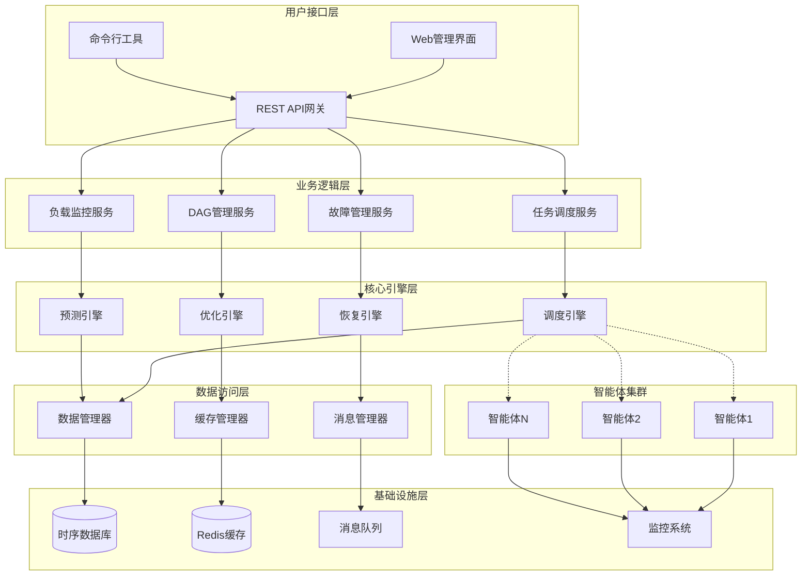

# 设计文档

## 概述

本设计文档详细描述了基于任务DAG和负载感知的多智能体任务调度系统的技术架构、核心组件和实现方案。系统采用分层架构设计，通过智能体负载感知、自适应DAG优化、预测性调度算法和分层故障恢复等核心技术，实现高效、可靠的多智能体任务调度。

## 系统架构

### 整体架构设计

系统采用分层微服务架构，主要包含以下层次：



### 核心架构原则

1. **分层解耦**：各层之间通过标准接口通信，降低耦合度
2. **微服务化**：核心功能模块化，支持独立部署和扩展
3. **事件驱动**：基于事件的异步通信机制，提高系统响应性
4. **数据一致性**：采用最终一致性模型，保证分布式数据一致性
5. **高可用性**：关键组件支持集群部署和故障转移

## 核心组件设计

### 1. 任务DAG管理组件

#### 1.1 DAG构建器 (DAG Builder)

**功能职责：**
- 自动分析任务依赖关系
- 构建有向无环图结构
- 检测和处理循环依赖

**核心算法：**
```python
class DAGBuilder:
    def build_dag(self, task_definition):
        """
        构建任务DAG
        """
        # 1. 解析任务定义
        tasks = self.parse_tasks(task_definition)
        
        # 2. 识别依赖关系
        dependencies = self.identify_dependencies(tasks)
        
        # 3. 循环检测
        if self.has_cycle(dependencies):
            raise CyclicDependencyError("检测到循环依赖")
        
        # 4. 构建DAG结构
        dag = self.create_dag_structure(tasks, dependencies)
        
        # 5. 关键路径分析
        critical_path = self.analyze_critical_path(dag)
        
        return DAGStructure(dag, critical_path)
```

**数据结构：**
```python
@dataclass
class TaskNode:
    task_id: str
    task_type: str
    requirements: Dict[str, Any]
    estimated_duration: float
    dependencies: List[str]
    status: TaskStatus
    
@dataclass
class DAGStructure:
    nodes: Dict[str, TaskNode]
    edges: List[Tuple[str, str]]
    critical_path: List[str]
    parallel_groups: List[List[str]]
```

#### 1.2 DAG优化器 (DAG Optimizer)

**功能职责：**
- 动态优化DAG结构
- 最大化任务并行度
- 减少关键路径长度

**优化策略：**
```python
class DAGOptimizer:
    def optimize_dag(self, dag: DAGStructure, agent_capabilities: Dict):
        """
        优化DAG结构
        """
        # 1. 并行度优化
        optimized_dag = self.optimize_parallelism(dag)
        
        # 2. 资源约束优化
        optimized_dag = self.optimize_resource_constraints(
            optimized_dag, agent_capabilities
        )
        
        # 3. 负载均衡优化
        optimized_dag = self.optimize_load_balance(optimized_dag)
        
        return optimized_dag
    
    def optimize_parallelism(self, dag: DAGStructure):
        """
        优化任务并行度
        """
        # 识别可并行执行的任务组
        parallel_groups = self.identify_parallel_groups(dag)
        
        # 重组任务分组以最大化并行度
        return self.reorganize_parallel_groups(dag, parallel_groups)
```

### 2. 智能体负载感知组件

#### 2.1 负载监控器 (Load Monitor)

**功能职责：**
- 实时收集智能体负载数据
- 多维度负载指标计算
- 负载状态评估和预警

**监控指标体系：**
```python
@dataclass
class LoadMetrics:
    # 计算负载指标
    cpu_usage: float          # CPU使用率 (0-1)
    memory_usage: float       # 内存使用率 (0-1)
    disk_io_rate: float      # 磁盘I/O速率 (MB/s)
    
    # 网络负载指标
    network_bandwidth: float  # 网络带宽使用率 (0-1)
    network_latency: float   # 网络延迟 (ms)
    packet_loss_rate: float  # 丢包率 (0-1)
    
    # 任务匹配指标
    task_match_score: float  # 任务匹配度 (0-1)
    specialization_score: float  # 专业化程度 (0-1)
    
    # 历史性能指标
    success_rate: float      # 任务成功率 (0-1)
    avg_execution_time: float  # 平均执行时间 (s)
    resource_efficiency: float  # 资源利用效率 (0-1)
    
    timestamp: datetime
```

**负载评估算法：**
```python
class LoadEvaluator:
    def __init__(self):
        # 动态权重系数
        self.weights = {
            'cpu': 0.25,
            'memory': 0.20,
            'network': 0.15,
            'task_match': 0.25,
            'history': 0.15
        }
    
    def calculate_load_score(self, metrics: LoadMetrics, task_type: str):
        """
        计算综合负载评分
        """
        # 动态调整权重
        adjusted_weights = self.adjust_weights(task_type)
        
        # 计算各维度得分
        cpu_score = metrics.cpu_usage
        memory_score = metrics.memory_usage
        network_score = (metrics.network_bandwidth + 
                        metrics.network_latency / 100 + 
                        metrics.packet_loss_rate) / 3
        
        task_match_score = 1 - metrics.task_match_score  # 匹配度越高，负载越低
        history_score = (1 - metrics.success_rate + 
                        metrics.avg_execution_time / 3600 + 
                        1 - metrics.resource_efficiency) / 3
        
        # 加权综合评分
        load_score = (
            adjusted_weights['cpu'] * cpu_score +
            adjusted_weights['memory'] * memory_score +
            adjusted_weights['network'] * network_score +
            adjusted_weights['task_match'] * task_match_score +
            adjusted_weights['history'] * history_score
        )
        
        return min(load_score, 1.0)  # 限制在[0,1]范围内
```

#### 2.2 负载预测器 (Load Predictor)

**功能职责：**
- 基于历史数据预测负载趋势
- 支持短期、中期、长期预测
- 为调度决策提供前瞻性信息

**预测模型：**
```python
class LoadPredictor:
    def __init__(self):
        self.short_term_model = ARIMAModel()  # 短期预测(1-10分钟)
        self.medium_term_model = LSTMModel()  # 中期预测(10分钟-1小时)
        self.long_term_model = ProphetModel() # 长期预测(1小时以上)
    
    def predict_load(self, agent_id: str, prediction_horizon: int):
        """
        预测智能体负载
        """
        historical_data = self.get_historical_data(agent_id)
        
        if prediction_horizon <= 10:  # 短期预测
            return self.short_term_model.predict(historical_data, prediction_horizon)
        elif prediction_horizon <= 60:  # 中期预测
            return self.medium_term_model.predict(historical_data, prediction_horizon)
        else:  # 长期预测
            return self.long_term_model.predict(historical_data, prediction_horizon)
```

### 3. 智能调度引擎组件

#### 3.1 调度决策器 (Scheduler)

**功能职责：**
- 执行多目标优化调度
- 实现分层调度策略
- 动态调整调度参数

**多目标优化模型：**
```python
class MultiObjectiveScheduler:
    def __init__(self):
        self.objectives = {
            'execution_time': 0.4,    # 执行时间权重
            'load_balance': 0.3,      # 负载均衡权重
            'communication_cost': 0.2, # 通信成本权重
            'energy_consumption': 0.1  # 能耗权重
        }
    
    def schedule_task(self, task: Task, available_agents: List[Agent]):
        """
        多目标优化任务调度
        """
        best_agent = None
        best_score = float('inf')
        
        for agent in available_agents:
            # 计算各目标函数值
            exec_time = self.estimate_execution_time(task, agent)
            load_imbalance = self.calculate_load_imbalance(agent)
            comm_cost = self.calculate_communication_cost(task, agent)
            energy_cost = self.estimate_energy_consumption(task, agent)
            
            # 多目标优化评分
            score = (
                self.objectives['execution_time'] * exec_time +
                self.objectives['load_balance'] * load_imbalance +
                self.objectives['communication_cost'] * comm_cost +
                self.objectives['energy_consumption'] * energy_cost
            )
            
            if score < best_score:
                best_score = score
                best_agent = agent
        
        return SchedulingDecision(task, best_agent, best_score)
```

#### 3.2 分层调度管理器 (Hierarchical Scheduler)

**功能职责：**
- 实现三层调度架构
- 协调不同层次的调度决策
- 处理调度冲突和优化

**分层架构：**
```python
class HierarchicalScheduler:
    def __init__(self):
        self.global_scheduler = GlobalScheduler()    # 全局调度层
        self.local_scheduler = LocalScheduler()      # 局部调度层
        self.realtime_scheduler = RealtimeScheduler() # 实时调度层
    
    def schedule(self, tasks: List[Task]):
        """
        分层调度执行
        """
        # 1. 全局调度：任务到集群的分配
        cluster_assignments = self.global_scheduler.assign_to_clusters(tasks)
        
        # 2. 局部调度：集群内部精细化调度
        agent_assignments = {}
        for cluster_id, cluster_tasks in cluster_assignments.items():
            agent_assignments[cluster_id] = self.local_scheduler.assign_to_agents(
                cluster_tasks, cluster_id
            )
        
        # 3. 实时调度：紧急任务和故障处理
        final_assignments = self.realtime_scheduler.handle_realtime_events(
            agent_assignments
        )
        
        return final_assignments
```

### 4. 动态负载均衡组件

#### 4.1 负载均衡检测器 (Load Balance Detector)

**功能职责：**
- 实时检测负载不均衡状况
- 分析不均衡原因
- 触发负载均衡机制

**检测算法：**
```python
class LoadBalanceDetector:
    def __init__(self, imbalance_threshold=0.3):
        self.imbalance_threshold = imbalance_threshold
    
    def detect_imbalance(self, agents: List[Agent]):
        """
        检测负载不均衡
        """
        load_scores = [agent.current_load_score for agent in agents]
        
        # 计算负载方差
        mean_load = sum(load_scores) / len(load_scores)
        variance = sum((score - mean_load) ** 2 for score in load_scores) / len(load_scores)
        std_deviation = variance ** 0.5
        
        # 计算不均衡度
        imbalance_degree = std_deviation / mean_load if mean_load > 0 else 0
        
        if imbalance_degree > self.imbalance_threshold:
            # 识别过载和空闲智能体
            overloaded_agents = [agent for agent in agents 
                               if agent.current_load_score > mean_load + std_deviation]
            underloaded_agents = [agent for agent in agents 
                                if agent.current_load_score < mean_load - std_deviation]
            
            return ImbalanceDetection(
                is_imbalanced=True,
                imbalance_degree=imbalance_degree,
                overloaded_agents=overloaded_agents,
                underloaded_agents=underloaded_agents
            )
        
        return ImbalanceDetection(is_imbalanced=False)
```

#### 4.2 任务迁移管理器 (Task Migration Manager)

**功能职责：**
- 执行任务迁移策略
- 优化迁移成本
- 保证迁移过程的一致性

**迁移策略：**
```python
class TaskMigrationManager:
    def __init__(self):
        self.migration_strategies = {
            'proactive': ProactiveMigrationStrategy(),
            'reactive': ReactiveMigrationStrategy(),
            'negotiated': NegotiatedMigrationStrategy()
        }
    
    def migrate_tasks(self, imbalance_detection: ImbalanceDetection):
        """
        执行任务迁移
        """
        migration_plan = self.create_migration_plan(imbalance_detection)
        
        for migration in migration_plan.migrations:
            # 评估迁移成本
            cost = self.calculate_migration_cost(migration)
            
            if cost < migration.benefit:
                # 执行渐进式迁移
                self.execute_gradual_migration(migration)
            else:
                # 跳过高成本迁移
                continue
    
    def calculate_migration_cost(self, migration: TaskMigration):
        """
        计算任务迁移成本
        """
        # 状态传输成本
        state_transfer_cost = migration.task.state_size * 0.001  # ms per KB
        
        # 服务中断成本
        interruption_cost = migration.task.priority * 10  # ms
        
        # 重新初始化成本
        initialization_cost = migration.target_agent.initialization_time
        
        return state_transfer_cost + interruption_cost + initialization_cost
```

### 5. 故障检测与恢复组件

#### 5.1 多层故障检测器 (Multi-layer Fault Detector)

**功能职责：**
- 实现心跳检测、性能监控、通信监控
- 多层次故障识别和分类
- 故障预测和预警

**检测机制：**
```python
class MultiLayerFaultDetector:
    def __init__(self):
        self.heartbeat_detector = HeartbeatDetector()
        self.performance_detector = PerformanceDetector()
        self.communication_detector = CommunicationDetector()
        self.fault_predictor = FaultPredictor()
    
    def detect_faults(self, agents: List[Agent]):
        """
        多层故障检测
        """
        faults = []
        
        # 1. 心跳检测
        heartbeat_faults = self.heartbeat_detector.detect(agents)
        faults.extend(heartbeat_faults)
        
        # 2. 性能监控
        performance_faults = self.performance_detector.detect(agents)
        faults.extend(performance_faults)
        
        # 3. 通信监控
        communication_faults = self.communication_detector.detect(agents)
        faults.extend(communication_faults)
        
        # 4. 故障预测
        predicted_faults = self.fault_predictor.predict(agents)
        faults.extend(predicted_faults)
        
        return self.classify_faults(faults)
    
    def classify_faults(self, faults: List[Fault]):
        """
        故障分类
        """
        classified_faults = {
            'task_level': [],
            'agent_level': [],
            'system_level': []
        }
        
        for fault in faults:
            if fault.severity <= 0.3:
                classified_faults['task_level'].append(fault)
            elif fault.severity <= 0.7:
                classified_faults['agent_level'].append(fault)
            else:
                classified_faults['system_level'].append(fault)
        
        return classified_faults
```

#### 5.2 智能恢复管理器 (Intelligent Recovery Manager)

**功能职责：**
- 根据故障类型选择恢复策略
- 执行分层故障恢复
- 学习和优化恢复策略

**恢复策略：**
```python
class IntelligentRecoveryManager:
    def __init__(self):
        self.recovery_strategies = {
            'task_level': TaskLevelRecovery(),
            'agent_level': AgentLevelRecovery(),
            'system_level': SystemLevelRecovery()
        }
        self.strategy_optimizer = RecoveryStrategyOptimizer()
    
    def recover_from_faults(self, classified_faults: Dict):
        """
        智能故障恢复
        """
        recovery_results = {}
        
        # 按优先级处理故障
        for fault_level in ['system_level', 'agent_level', 'task_level']:
            faults = classified_faults.get(fault_level, [])
            
            if faults:
                strategy = self.recovery_strategies[fault_level]
                results = strategy.recover(faults)
                recovery_results[fault_level] = results
                
                # 学习和优化恢复策略
                self.strategy_optimizer.learn_from_recovery(faults, results)
        
        return recovery_results
```

## 数据模型设计

### 核心数据实体

#### 1. 任务实体 (Task Entity)
```python
@dataclass
class Task:
    task_id: str
    task_type: str
    priority: int
    requirements: TaskRequirements
    dependencies: List[str]
    estimated_duration: float
    actual_duration: Optional[float]
    status: TaskStatus
    assigned_agent: Optional[str]
    created_at: datetime
    started_at: Optional[datetime]
    completed_at: Optional[datetime]
    retry_count: int
    max_retries: int
    
@dataclass
class TaskRequirements:
    cpu_cores: int
    memory_mb: int
    disk_space_mb: int
    network_bandwidth_mbps: float
    specialized_capabilities: List[str]
    execution_environment: str
```

#### 2. 智能体实体 (Agent Entity)
```python
@dataclass
class Agent:
    agent_id: str
    agent_type: str
    capabilities: AgentCapabilities
    current_load: LoadMetrics
    status: AgentStatus
    location: str
    last_heartbeat: datetime
    total_tasks_completed: int
    average_task_duration: float
    success_rate: float
    
@dataclass
class AgentCapabilities:
    cpu_cores: int
    memory_mb: int
    disk_space_mb: int
    network_bandwidth_mbps: float
    specialized_skills: List[str]
    supported_environments: List[str]
    max_concurrent_tasks: int
```

#### 3. DAG实体 (DAG Entity)
```python
@dataclass
class DAG:
    dag_id: str
    name: str
    description: str
    version: str
    nodes: Dict[str, TaskNode]
    edges: List[DAGEdge]
    critical_path: List[str]
    estimated_total_duration: float
    status: DAGStatus
    created_at: datetime
    updated_at: datetime
    
@dataclass
class DAGEdge:
    source_task_id: str
    target_task_id: str
    dependency_type: str  # 'data', 'control', 'resource'
    weight: float
```

### 数据存储策略

#### 1. 时序数据存储
- **负载监控数据**：使用InfluxDB存储智能体负载时序数据
- **任务执行历史**：使用InfluxDB存储任务执行时间序列
- **系统性能指标**：使用InfluxDB存储系统级性能数据

#### 2. 关系数据存储
- **任务和智能体元数据**：使用PostgreSQL存储结构化数据
- **DAG结构信息**：使用PostgreSQL存储图结构数据
- **用户和权限信息**：使用PostgreSQL存储认证授权数据

#### 3. 缓存存储
- **实时负载状态**：使用Redis缓存当前负载信息
- **调度决策缓存**：使用Redis缓存频繁访问的调度结果
- **会话和临时数据**：使用Redis存储会话状态

## 接口设计

### 1. REST API接口

#### 任务管理接口
```yaml
# 提交任务
POST /api/v1/tasks
Content-Type: application/json
{
  "task_definition": {
    "name": "data_processing_workflow",
    "tasks": [...],
    "dependencies": [...]
  }
}

# 查询任务状态
GET /api/v1/tasks/{task_id}

# 取消任务
DELETE /api/v1/tasks/{task_id}
```

#### 智能体管理接口
```yaml
# 注册智能体
POST /api/v1/agents
Content-Type: application/json
{
  "agent_id": "agent_001",
  "capabilities": {...},
  "location": "datacenter_1"
}

# 查询智能体状态
GET /api/v1/agents/{agent_id}

# 更新智能体状态
PUT /api/v1/agents/{agent_id}/status
```

#### 调度管理接口
```yaml
# 获取调度统计
GET /api/v1/scheduling/stats

# 调整调度策略
PUT /api/v1/scheduling/strategy
Content-Type: application/json
{
  "strategy_type": "multi_objective",
  "parameters": {...}
}
```

### 2. WebSocket接口

#### 实时监控接口
```javascript
// 连接实时监控
const ws = new WebSocket('ws://localhost:8080/ws/monitoring');

// 订阅智能体状态
ws.send(JSON.stringify({
  type: 'subscribe',
  topic: 'agent_status',
  agent_ids: ['agent_001', 'agent_002']
}));

// 接收实时数据
ws.onmessage = function(event) {
  const data = JSON.parse(event.data);
  // 处理实时负载数据
};
```

### 3. gRPC接口

#### 智能体通信接口
```protobuf
service AgentCommunication {
  rpc RegisterAgent(AgentRegistration) returns (RegistrationResponse);
  rpc SendHeartbeat(HeartbeatMessage) returns (HeartbeatResponse);
  rpc ReceiveTask(TaskAssignment) returns (TaskAcceptance);
  rpc ReportTaskStatus(TaskStatusReport) returns (StatusAcknowledgment);
}

message AgentRegistration {
  string agent_id = 1;
  AgentCapabilities capabilities = 2;
  string location = 3;
}

message TaskAssignment {
  string task_id = 1;
  TaskDefinition task = 2;
  int64 deadline = 3;
}
```

## 错误处理策略

### 1. 错误分类

#### 系统级错误
- **网络分区**：智能体集群间网络连接中断
- **存储故障**：数据库或缓存系统故障
- **服务崩溃**：核心调度服务异常终止

#### 业务级错误
- **任务执行失败**：智能体执行任务时发生错误
- **资源不足**：系统资源无法满足任务需求
- **依赖冲突**：任务依赖关系存在冲突

#### 数据级错误
- **数据不一致**：分布式数据同步异常
- **数据损坏**：存储数据完整性校验失败
- **数据丢失**：关键数据意外删除或丢失

### 2. 错误处理机制

#### 重试机制
```python
class RetryHandler:
    def __init__(self):
        self.retry_policies = {
            'exponential_backoff': ExponentialBackoffPolicy(),
            'fixed_interval': FixedIntervalPolicy(),
            'linear_backoff': LinearBackoffPolicy()
        }
    
    def retry_with_policy(self, operation, policy_name='exponential_backoff', max_retries=3):
        policy = self.retry_policies[policy_name]
        
        for attempt in range(max_retries):
            try:
                return operation()
            except RetryableException as e:
                if attempt == max_retries - 1:
                    raise e
                
                delay = policy.calculate_delay(attempt)
                time.sleep(delay)
        
        raise MaxRetriesExceededException()
```

#### 熔断机制
```python
class CircuitBreaker:
    def __init__(self, failure_threshold=5, recovery_timeout=60):
        self.failure_threshold = failure_threshold
        self.recovery_timeout = recovery_timeout
        self.failure_count = 0
        self.last_failure_time = None
        self.state = 'CLOSED'  # CLOSED, OPEN, HALF_OPEN
    
    def call(self, operation):
        if self.state == 'OPEN':
            if time.time() - self.last_failure_time > self.recovery_timeout:
                self.state = 'HALF_OPEN'
            else:
                raise CircuitBreakerOpenException()
        
        try:
            result = operation()
            self.on_success()
            return result
        except Exception as e:
            self.on_failure()
            raise e
```

## 测试策略

### 1. 单元测试

#### 核心算法测试
```python
class TestDAGBuilder(unittest.TestCase):
    def setUp(self):
        self.dag_builder = DAGBuilder()
    
    def test_build_simple_dag(self):
        task_definition = {
            'tasks': [
                {'id': 'task1', 'dependencies': []},
                {'id': 'task2', 'dependencies': ['task1']},
                {'id': 'task3', 'dependencies': ['task1']}
            ]
        }
        
        dag = self.dag_builder.build_dag(task_definition)
        
        self.assertEqual(len(dag.nodes), 3)
        self.assertEqual(len(dag.edges), 2)
        self.assertIn('task1', dag.critical_path)
    
    def test_cycle_detection(self):
        task_definition = {
            'tasks': [
                {'id': 'task1', 'dependencies': ['task2']},
                {'id': 'task2', 'dependencies': ['task1']}
            ]
        }
        
        with self.assertRaises(CyclicDependencyError):
            self.dag_builder.build_dag(task_definition)
```

#### 负载评估测试
```python
class TestLoadEvaluator(unittest.TestCase):
    def setUp(self):
        self.load_evaluator = LoadEvaluator()
    
    def test_load_score_calculation(self):
        metrics = LoadMetrics(
            cpu_usage=0.5,
            memory_usage=0.6,
            network_bandwidth=0.3,
            task_match_score=0.8,
            success_rate=0.9
        )
        
        score = self.load_evaluator.calculate_load_score(metrics, 'compute_intensive')
        
        self.assertGreaterEqual(score, 0.0)
        self.assertLessEqual(score, 1.0)
```

### 2. 集成测试

#### 端到端调度测试
```python
class TestEndToEndScheduling(unittest.TestCase):
    def setUp(self):
        self.scheduler = HierarchicalScheduler()
        self.agents = self.create_test_agents()
        self.tasks = self.create_test_tasks()
    
    def test_complete_scheduling_workflow(self):
        # 提交任务
        assignments = self.scheduler.schedule(self.tasks)
        
        # 验证所有任务都被分配
        self.assertEqual(len(assignments), len(self.tasks))
        
        # 验证负载均衡
        load_variance = self.calculate_load_variance(assignments)
        self.assertLess(load_variance, 0.3)
        
        # 验证依赖关系满足
        self.assertTrue(self.verify_dependencies(assignments))
```

### 3. 性能测试

#### 调度性能测试
```python
class TestSchedulingPerformance(unittest.TestCase):
    def test_large_scale_scheduling(self):
        # 创建大规模测试数据
        agents = self.create_agents(count=1000)
        tasks = self.create_tasks(count=10000)
        
        start_time = time.time()
        assignments = self.scheduler.schedule(tasks)
        end_time = time.time()
        
        scheduling_time = end_time - start_time
        
        # 验证调度时间在可接受范围内
        self.assertLess(scheduling_time, 30.0)  # 30秒内完成
        
        # 验证调度质量
        self.assertGreater(self.calculate_scheduling_quality(assignments), 0.8)
```

### 4. 故障测试

#### 故障恢复测试
```python
class TestFaultRecovery(unittest.TestCase):
    def test_agent_failure_recovery(self):
        # 模拟智能体故障
        failed_agent = self.agents[0]
        failed_agent.status = AgentStatus.FAILED
        
        # 触发故障检测和恢复
        recovery_manager = IntelligentRecoveryManager()
        recovery_result = recovery_manager.handle_agent_failure(failed_agent)
        
        # 验证任务重新分配
        self.assertTrue(recovery_result.tasks_reassigned)
        self.assertLess(recovery_result.recovery_time, 5.0)  # 5秒内恢复
```

通过这个全面的设计文档，我们详细描述了多智能体任务调度系统的技术架构、核心组件、数据模型、接口设计、错误处理和测试策略。这个设计为系统的实现提供了清晰的技术路线图和实现指导。